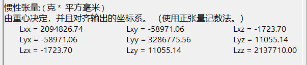

### 1. 无人机的质量（MASS）

* **步骤** ：

1. 在装配体模式下，确保所有零件都被完全定义和约束。
2. 使用“质量属性”功能。
3. 在顶部菜单栏中选择 `工具 > 质量属性`，系统会自动计算整个装配体的质量。

* **注意** ：
* 确保所有零件的材料属性已正确设置。

质量：615.79g

### 2. 臂长（L）

* **步骤** ：

1. 在装配体模式下，使用测量工具。
2. 选择从中心（通常是无人机的质心或电机安装中心）到电机安装点的距离。
3. 使用 `评估 > 测量`工具，选择两个参考点即可获得距离。

128.74mm

### 3. 推重比（THRUST2WEIGHT_RATIO）

* **步骤** ：

1. 推力需要根据电机和螺旋桨的规格手册获取，不直接通过SolidWorks测量。
2. 知道质量（从质量属性中获得）和总推力（根据电机和螺旋桨的最大推力计算）。
3. 计算推重比： TWR=总推力重量**TWR**=**重量**总推力****。

最大拉力：1.32 千克/ 轴

### 4. 惯性矩阵（J 和 J_INV）

* **步骤** ：

1. 在装配体模式下，使用质量属性功能。
2. 在 `质量属性`窗口中，系统会提供装配体的惯性矩阵。
3. 惯性矩阵的逆矩阵（J_INV）可以使用数学软件如Matlab或Python中的NumPy库计算。

### 5. 推力系数（KF）和力矩系数（KM）

* **说明** ：
* 这些系数通常基于实验数据或制造商提供的螺旋桨和电机测试数据，并非直接从SolidWorks中测量。

### 6. 碰撞体的尺寸（COLLISION_H, COLLISION_R, COLLISION_Z_OFFSET）

* **步骤** ：

1. 使用测量工具测量无人机的高度、半径和偏移量。
2. 在装配体模式下，选择 `评估 > 测量`，然后选择相应的几何特征。
3. 高度：从底部到顶部的最大距离。
4. 半径：无人机的最大横截面半径。
5. Z轴偏移量：选择中心到碰撞体边缘的垂直距离。

h: 93.8mm

z: 46.76mm

### 7. 最大速度（MAX_SPEED_KMH）

* **说明** ：
* 这是根据无人机的动力系统和空气动力学特性，通过计算和实验得出的参数，通常不通过SolidWorks直接获取。

### 8. 地面效应系数（GND_EFF_COEFF）

* **说明** ：
* 这是基于空气动力学的实验数据，不通过SolidWorks直接获取。

### 9. 螺旋桨半径（PROP_RADIUS）

* **步骤** ：

1. 使用测量工具测量螺旋桨的半径。
2. 在装配体模式下，选择螺旋桨的中心和任意一个桨叶末端点进行测量。

145.9mm

### 10. 阻力系数（DRAG_COEFF）

* **说明** ：
* 需要进行风洞实验或计算流体力学（CFD）模拟来获取，不通过SolidWorks直接测量。

### 11. 涡流效应系数（DW_COEFF_1, DW_COEFF_2, DW_COEFF_3）

* **说明** ：
* 这些系数是通过实验或CFD模拟得到的。

### 12. PWM与转速关系（PWM2RPM_SCALE, PWM2RPM_CONST, MIN_PWM, MAX_PWM）

* **说明** ：
* 这些参数通过实验测量得到，不通过SolidWorks直接获取。

### 总结：

通过SolidWorks，您可以准确地测量与几何形状和质量相关的参数，例如质量、惯性矩、臂长和碰撞体尺寸。而推重比、推力系数、力矩系数、最大速度等通常需要结合实验数据和制造商提供的资料来获得。对于更复杂的气动力参数，CFD模拟和实验测试是必要的。
