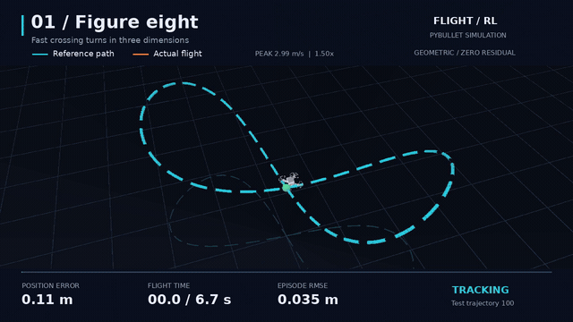
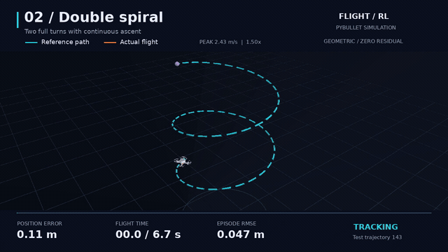
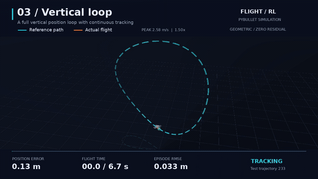
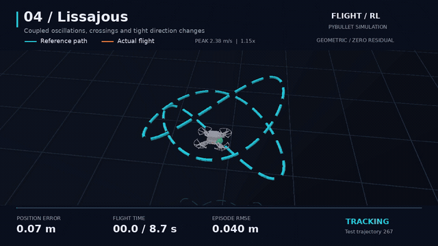
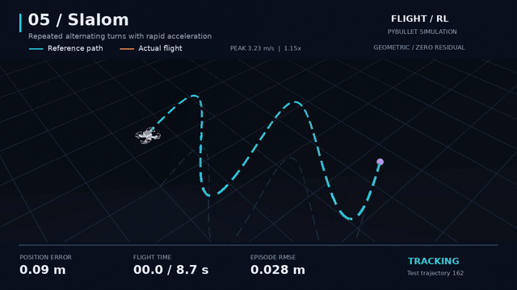
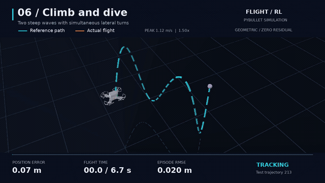

# Flight-RL

Quadrotor trajectory tracking with **PyBullet, Gymnasium, and PPO**. Generate diverse flight paths, train direct or residual policies, and compare reference paths with actual flights.

<p align="center">
  
  
</p>
<p align="center">
  
  
</p>
<p align="center">
  
  
</p>

**Cyan:** reference path. **Orange:** actual flight. These selected test flights use the **geometric controller with zero RL residual**; residual PPO training has not improved this baseline. Full flights play at their original speed. [Demo metrics and seeds](docs/media/manifest.json).

## Setup

Tested on Linux with Python 3.11, PyTorch 2.7.1 (CPU), and PyBullet 3.2.7. No GPU is required for training or evaluation.

```bash
git clone https://github.com/calcualatexzy/Flight-RL.git
cd Flight-RL
conda env create -f environment.yml
conda activate flight-rl
```

## Quick start

Generate the default dataset and run a reproducible controller baseline. No pretrained download or PPO training is needed for this demo.

```bash
python -m FlightEnv.trajectory_dataset
python scripts/create_baseline.py

python main.py eval --model runs/residual_baseline/baseline.zip \
  --family figure8 --episodes 1 --seed 2026 \
  --time-profile cruise --speed-min 1.5 --speed-max 1.5 \
  --render --playback-speed 1 --output-dir runs/demo
```

For headless evaluation, omit `--render`. The dataset contains **2,304 training, 288 validation, and 288 test paths** across nine families: hover, line, circle, figure eight, helix, slalom, wave, vertical loop, and Lissajous.

## Train

Two profiles are available: `tracking` learns thrust and moments directly; `residual` learns bounded corrections to geometric feedforward control.

```bash
# Start residual PPO training in the background with a validated speed curriculum.
python scripts/start_speed_training.py --run-dir runs/residual_speed --num-envs 4
tail -f runs/residual_speed/training.log
```

The run saves initial, best, periodic, and final checkpoints. See the [training guide](docs/guide.md#training) for foreground training, direct PPO, custom datasets, and resume commands.

## Evaluate

```bash
python main.py eval --model runs/residual_baseline/baseline.zip \
  --all-trajectories --seed 2026 --difficulty 1 \
  --time-profile cruise --speed-min 1.5 --speed-max 1.5 \
  --output-dir runs/baseline_test
```

The zero-residual baseline completes **254/256** held-out flights; **227/256** meet the strict tracking criteria. Mean per-flight position RMSE is **5.675 cm**. Success requires a complete flight, RMSE at most **10 cm**, and maximum error at most **30 cm**. Requested speed is limited by reference dynamics. [All results, including failures](docs/benchmarks/residual_baseline_cruise_150.json).

## Export demos

Requires FFmpeg, DejaVu Sans fonts, and EGL for GPU rendering. The default dataset and baseline above reproduce the six demo paths.

```bash
python -m FlightEnv.difficult_showcase --output exports/difficult_flights_6
python scripts/export_readme_demos.py --input-dir exports/difficult_flights_6
```

Exports include six MP4s, a preview page, flight traces, metrics, and a ZIP. The second command creates the looping README GIFs. [Rendering options](docs/guide.md#visualization-and-export).

## Documentation and tests

- [User guide](docs/guide.md): installation, datasets, training, checkpoints, and troubleshooting.
- [Demo provenance](docs/media/manifest.json) and [release verification](docs/benchmarks/release_verification.json).
- Run `python -m pytest -q` for the 67 automated checks; tests generate their own temporary data.
